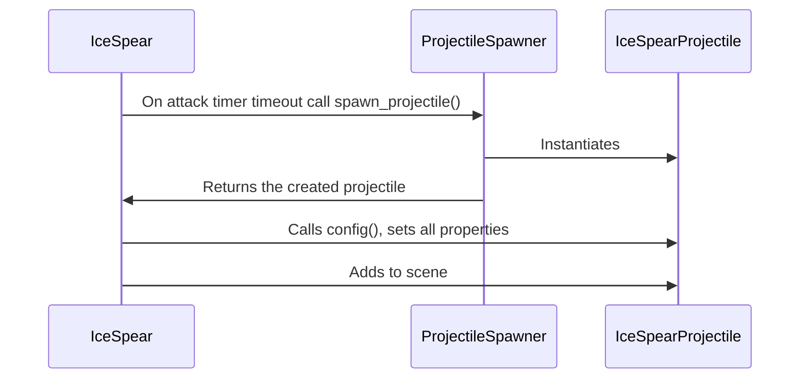

#code/weapons/managers

# Fields
Field type|Field name|Description
-|-|-
`float`|`attack_speed`|The number of [[Ice Spear Projectile\|projectile]] spawns per second
`float`|`damage`|Amount of damage dealt by single [[Ice Spear Projectile\|projectile]]
`float`|`projectile_speed`|Speed of the [[Ice Spear Projectile\|projectile]]'s movement
`int`|`projectile_pierce_amount`|The amount of targets a [[Ice Spear Projectile\|projectile]] can pierce before it's destroyed
~~`float?`~~|~~`knockback`~~|**Unused for now**
# Public Methods
Return type|Method name|Description
-|-|-
`Vector2, null`|`get_direction_to_target()`|Uses [[Projectile Spawner]]'s `get_targets()` and `distance_weighted_random_choice()` to find a nearby enemy, then returns a `Vector2` direction pointing to the target. If no targets nearby returns `null`
`null`|`on_attack_timer_timeout()`|Spawns a new [[Ice Spear Projectile\|projectile]] when the attack timer timeouts

# How it works
>[!bug] Graph rendering bug
>On my device this Mermaid graph only seems to render correctly in **edit mode**. If you're getting an error like this switching the view to edit mode may help.
>```
>Error parsing Mermaid diagram! 
>Parse error on line 3:
> ...quenceDiagram&nbsp; &nbsp; IceSpear->> 
> ---------------------^
>Expecting 'SOLID_OPEN_ARROW', 'DOTTED_OPEN_ARROW', 'SOLID_ARROW', 'DOTTED_ARROW', 'SOLID_CROSS', 'DOTTED_CROSS', 'SOLID_POINT', 'DOTTED_POINT', got 'NEWLINE'
>```


