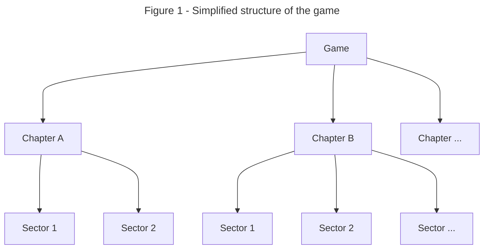
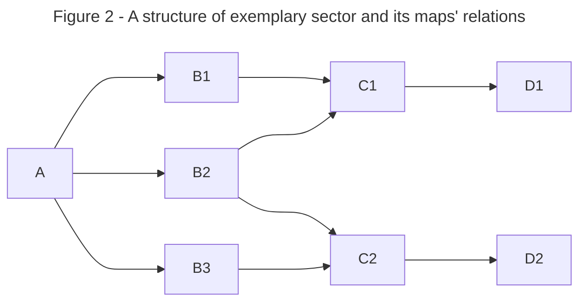

___

*Based on our Miro, as of 30th Oct 2023*

>This is an outline of how stages and maps work in Monstrous Tide - regarding game structure, enemy spawns, drops and their probabilities and much more.

# Structure

Game is divided into *Chapters*, which contain a few - for example 5 - *Sectors*, which are made of particular set of *Maps* (fig. 1). Player can choose whichever Chapter to play, there is no order, whereas Sectors will be ordered linearly and Maps will be ordered and structured like a mesh and completing one Map will open player's way only to directly selected, next tier Maps (fig. 2).

where A, B, C... indicate different *[[Biomes concept list|biomes]]*, which player may select, at equal tiers of said sector[^1]. Multiple instances at the same tier (f.e. B1, B2, ...) will have different features, such as: 
- varied level difficulties,
- different items and/or their drop-rates,
- different sets of enemies and/or their spawn-rates.

# Shops

After each aforementioned Map (node on fig. 2) there will be a specific shop available in which player will be able to buy specified items, upgrades, abilities, bonuses and/or weapons with a specified [[__Currencies ideas__|currency]].

# Story relations

>[!attention] ***Suggestion:***
>Every single chapter/sector is other, different playable character, not to be chosen by the player. After completing said chapter/sector with given character, they will show up in some kind of [[Journal]], among other related entries.

All the Chapters will be in the same world, of the same history and events and will provide players with different items which will unveil the story to them. Understanding that story is a minor part of the project, it will be rather in the background of the work.

[^1]: This does not mean it *must* be this way - there may be special, one of a kind biomes only on one node, or special modes available only on a few of them.